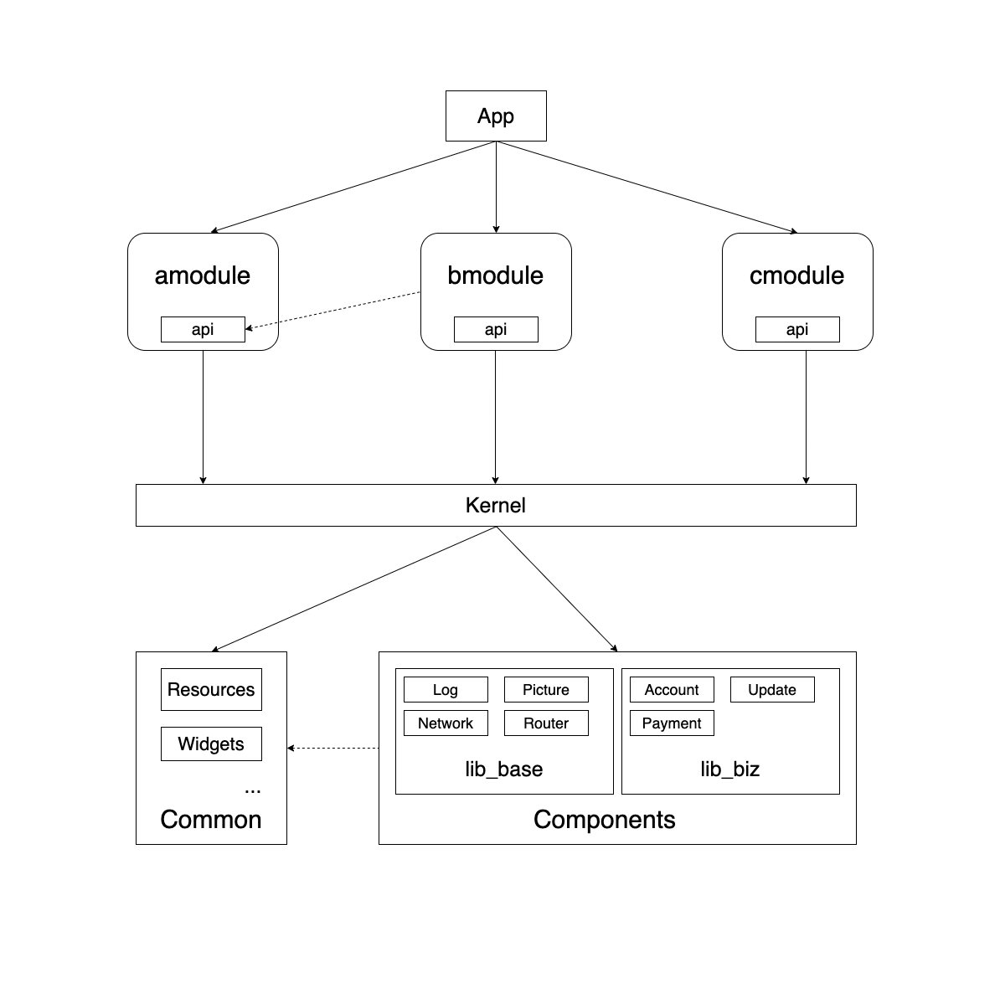

# Android 模块化
> 本项目是Android开发过程中对架构模块化的一种实现思路，包含整体的分层结构以及在此基础上的插件设计。为了加快android的项目编译，通常的做法是使用aar或者maven仓库依赖的方式加快编译的速度，但是会出现对调试不友好，本插件也是以这个为基础，可以通过灵活的配置完成对源码和aar依赖的切换。

## 项目架构


### Android项目大概分为这几个部分：

### 1. App宿主
App的主module，业务层的模块在此组装和初始化，此外通过signingConfig, productFlavors等配置完成Apk的打包。

App宿主基本可以理解为一个空壳，不涉及任何业务，可以根据需求引入对应的业务module，唯一需要处理的就是Application里边进行模块和组件库的初始化，这可以使用JetPack的StartUp组件进行处理，将模块初始化回归到业务module，最终在Application进行注册就好。

### 2. 业务模块
业务模块主要包含两部分，除了正常业务的代码之外，还有该业务模块对外暴露的api接口，可以使用插件直接打包接口并发布到maven仓库，解决了业务module之间依赖会下沉到base库中的问题，需要依赖的接口的module只需引用对应module的接口包就好，可以通过Arouter的方式对代码进行访问。

### 3. Kernel层
Kernel层负责给各个业务模块提供基础组件，使业务层无需关心具体依赖的组件库，方便业务的开发，同时对于底层的依赖也有统一的管理。

业务方需要功能接口时只需查阅文档使用对应的api接口即可，这样会使项目加强对基础组件的重视，每个组件都有完备的测试和文档。

### 4. 通用资源
通用资源库会为项目提供通用的资源比如常用字符串，通用的图标，以及UI库等，防止业务module引用相同的资源，帮助apk瘦身。

### 5. 组件库
组件库包含两部分，一部分是基础模块，可能是自研的工具，或者是对开源框架的封装，另一部分是和业务相关，比如公司内统一的支付sdk，账号模块等。


## 插件
> 为了支持以上架构的开发，插件的功能目前包含发布api接口，module的aar包到maven仓库，以及在调试时方便的进行aar包和module源码的切换。

### 1. SettingsPlugin
setting.gradle中引入，可以动态的添加项目编译的module。
需要进行源码调试时，进行如下配置，引入module名称以及module对应的外部路径。

```
apply plugin: 'modular'
// 外部依赖模块的引用配置，include 包含：moduleName, moduleDir
ExternalDependency {
    include "amodule" , "./modules/amodule"
    include "bmodule" , "./modules/bmodule"
}
```

### 2. ModularPublishPlugin
引用插件时会自动为module中添加publish的task，包含发布api接口以及module的aar包。

```
publish {
    api {
        srcDirs "com/goverse/amodule/api/"
        repository "../../maven"
        groupId "com.goverse.modular"
        artifactId "amodule_api"
        version "1.0.0"
        variant "Debug"
    }

    aar {
        repository "../../maven"
        groupId "com.goverse.modular"
        artifactId "amodule"
        version "1.0.0"
        variant "Debug"
    }
}
```

### 3. ModularDependencyPlugin
用于管理对module的依赖，替换默认的dependencies，通过以下配置实现引入，并通过sourceCode成员决定是否引用源码依赖。

```
moduleDependencies {

    bmodule_api {
        sourceCode false
        buildType "implementation"
        groupId "com.goverse.modular"
        artifactId "bmodule_api"
        version "1.0.0"
    }
}
```


